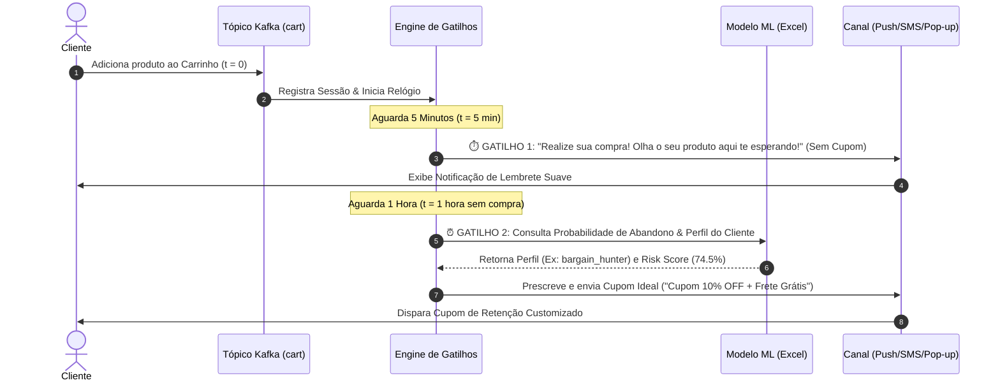

# Documentação Técnica: Modelo de ML em Excel & Arquitetura de Gatilhos Temporais

Esta documentação especifica o funcionamento completo do **Modelo de Machine Learning treinado via Excel (`.xlsx`)**, a classificação automática entre os **3 Perfis de Clientes**, e a esteira de execução dos **2 Gatilhos Temporais de Eventos (Cart + 5 Minutos e Cart + 1 Hora)**.

---

## 📌 1. Estrutura do Dataset no Excel (`modelo_carrinho_excel.xlsx`)

O modelo de aprendizado de máquina lê diretamente a planilha Excel. Cada linha representa uma **sessão de carrinho de cliente**.

### Dicionário de Colunas da Planilha Excel:

| Nome da Coluna | Tipo | Descrição & Utilização no ML |
| :--- | :--- | :--- |
| `session_id` | `String` | Identificador único UUID v4 da sessão do cliente. |
| `user_id` | `Integer` | Código de identificação do cliente no sistema. |
| `total_cart_value` | `Float` | Valor total acumulado dos itens no carrinho (em R$). |
| `num_cart_items` | `Integer` | Quantidade de itens distintos no carrinho. |
| `num_views_before_cart` | `Integer` | Número de páginas de produto visualizadas antes do carrinho. |
| `session_duration_sec` | `Integer` | Tempo total navegando na sessão (em segundos). |
| `hour_of_day` | `Integer` | Hora do dia da ação no carrinho (0 a 23h). |
| `is_night` | `Binary (0/1)` | Flag indicando se a ação foi noturna/madrugada (22h às 06h). |
| **`user_profile`** | `String` | Target do Perfil: `high_intent`, `bargain_hunter` ou `browser`. |
| **`is_abandoned`** | `Binary (0/1)` | Target do Abandono: `1` se abandonou, `0` se comprou. |

---

## 👥 2. Os 3 Perfis de Clientes (Classificação ML)

### 1. 🎯 Comprador de Alta Intenção (`high_intent`)
- **Característica**: Poucas visualizações (1 a 3 views), decisão rápida, navegação em horário comercial.
- **Risco Preditivo**: Baixo a Moderado (\(p < 45\%\)).
- **Estratégia de Negócio**: Não dar descontos agressivos no início para **proteger a margem de lucro**.

### 2. 🤑 Caçador de Descontos (`bargain_hunter`)
- **Característica**: Alto número de visualizações (6+ views), comparação entre marcas, navegação de madrugada (`is_night == 1`).
- **Risco Preditivo**: Alto a Crítico (\(p \ge 65\%\)).
- **Estratégia de Negócio**: Exige ofertas fortes (**Cupom 10% a 15% OFF + Frete Grátis**) para destravar a compra.

### 3. 🔍 Navegador Indeciso (`browser`)
- **Característica**: Tempo de sessão elevado, alta razão $\frac{\text{views}}{\text{itens}}$, indecisão na escolha.
- **Risco Preditivo**: Moderado a Alto (\(45\% \le p < 65\%\)).
- **Estratégia de Negócio**: Eliminar a maior barreira de decisão oferecendo **Frete Grátis Shopee + 5% OFF**.

---

## ⚡ 3. Arquitetura dos 2 Gatilhos Temporais de Eventos

A esteira de eventos inicia no momento exato em que o evento `cart` é registrado no sistema ($t = 0$):



### Detalhamento dos Gatilhos:

#### ⏱️ Gatilho 1: Cart + 5 Minutos (Lembrete Suave)
- **Janela de Tempo**: 5 minutos sem evento de compra (`purchase`).
- **Mensagem Disparada**: *"Realize sua compra! Olha o seu produto aqui te esperando!"*.
- **Custo para o Negócio**: **Zero (R$ 0,00)** — Apenas engajamento sem concessão de desconto.

#### ⏰ Gatilho 2: Cart + 1 Hora (Ação Prescritiva Preditiva com ML)
- **Janela de Tempo**: 1 hora após o carrinho sem conversão.
- **Ação**: O modelo treinado no Excel avalia a sessão e aplica a regra prescritiva específica para o **Perfil 1, 2 ou 3** do cliente.

---

## 💻 4. Como Executar os Scripts no Projeto

### 1. Para Treinar o Modelo com sua Planilha Excel:
```bash
python3 src/train_excel_model.py
```
*(Caso não haja o arquivo `modelo_carrinho_excel.xlsx`, o script cria uma planilha de exemplo e realiza o treinamento imediatamente).*

### 2. Para Executar o Simulador dos 2 Gatilhos:
```bash
python3 src/kafka_triggers_simulator.py
```
